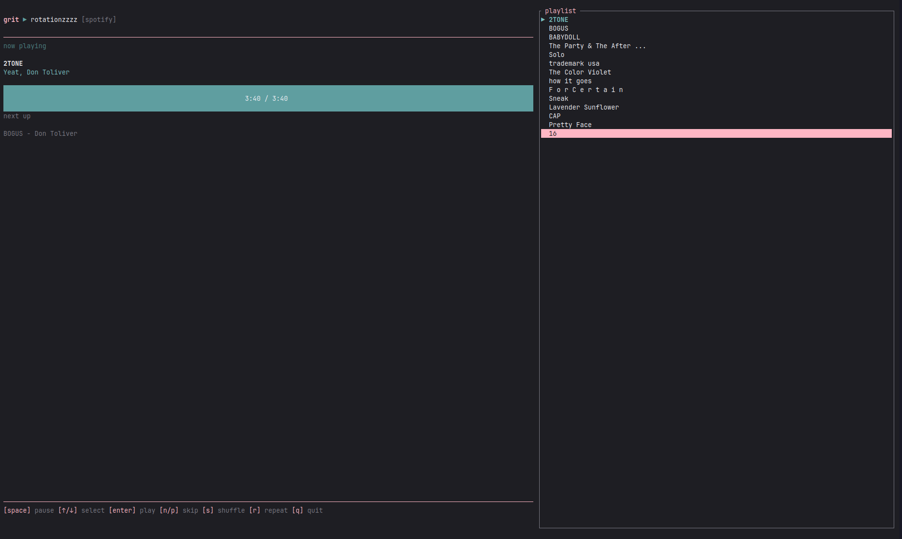

# grit

Git-like version control for your playlists. Track changes, sync across Spotify and YouTube, and play music with a beautiful TUI.



```
grit init https://open.spotify.com/playlist/37i9dqef...
grit search "lofi beats"
grit add 4iV5W9uYEdYUVa79Axb7Rh
grit commit -m "add chill vibes"
grit push
grit play -l 37i9dqef...
```

## Features

- **Version Control** - Track playlist changes with git-like commands (init, commit, push, pull, diff, log)
- **Multi-Provider** - Supports Spotify and YouTube playlists
- **TUI Player** - Beautiful terminal interface with progress bar, queue, and controls
- **Synced Lyrics** - Real-time lyrics display via LRCLIB (works with both Spotify and YouTube)
- **Staging Area** - Stage changes before committing (add, remove, move tracks)
- **Offline-First** - Local state with on-demand remote sync
- **Live Reload** - TUI updates when playlist file changes externally

## Installation

### Prerequisites

For YouTube playback:
```bash
# mpv (media player)
sudo apt install mpv        # Debian/Ubuntu
brew install mpv            # macOS

# yt-dlp (YouTube audio extraction)
pip install yt-dlp
```

For Spotify playback:
- Spotify Premium account (for Spotify Connect)
- A Spotify device (desktop app, phone, etc.) must be active

### Build from source

```bash
git clone https://github.com/pixperk/grit
cd grit
cargo build --release

# Add to PATH
cp target/release/grit ~/.local/bin/
# or
sudo cp target/release/grit /usr/local/bin/
```

### Cargo

```bash
cargo install --git https://github.com/pixperk/grit
```

### Nix

```bash
# Run directly (compiles from source, includes dependencies)
nix run github:pixperk/grit

# Or install to profile
nix profile install github:pixperk/grit
```

### Environment Variables

Create a `.env` file or export these:

```bash
# Spotify API (https://developer.spotify.com/dashboard)
SPOTIFY_CLIENT_ID=your_client_id
SPOTIFY_CLIENT_SECRET=your_client_secret

# YouTube API (https://console.cloud.google.com)
YOUTUBE_CLIENT_ID=your_client_id
YOUTUBE_CLIENT_SECRET=your_client_secret
```

## Quick Start

```bash
# 1. Authenticate with your provider
grit auth spotify
grit auth youtube

# 2. Start tracking a playlist
grit init https://open.spotify.com/playlist/37i9dqef1DX...
grit init https://youtube.com/playlist?list=PL...

# 3. Play your music
grit play -l 37i9dqef1DX...
```

## Commands

### Authentication

| Command | Description |
|---------|-------------|
| `grit auth <provider>` | Authenticate with Spotify or YouTube |
| `grit logout <provider>` | Remove stored credentials |
| `grit whoami <provider>` | Show authenticated user info |

### Playlist Management

| Command | Alias | Description |
|---------|-------|-------------|
| `grit init <url>` | `i` | Start tracking a playlist |
| `grit playlists [query]` | | List all tracked playlists |
| `grit list` | `ls` | List tracks in playlist |
| `grit find <query>` | | Search within playlist |

### Staging Changes

| Command | Alias | Description |
|---------|-------|-------------|
| `grit search <query>` | `s` | Search for tracks to add |
| `grit add <track-id>` | `a` | Stage a track for addition |
| `grit remove <track-id>` | `rm` | Stage a track for removal |
| `grit move <track-id> <index>` | `mv` | Stage a track to be moved |
| `grit reset` | | Clear all staged changes |

### Version Control

| Command | Alias | Description |
|---------|-------|-------------|
| `grit status` | `st` | Show staged changes and sync status |
| `grit commit -m "msg"` | `c` | Commit staged changes locally |
| `grit push` | | Push local changes to remote |
| `grit pull` | | Pull remote changes to local |
| `grit diff` | `d` | Show differences (--staged or --remote) |
| `grit log` | | Show commit history |
| `grit revert [hash]` | | Revert to a previous commit |
| `grit apply <file>` | | Apply playlist state from YAML |

### Playback

| Command | Alias | Description |
|---------|-------|-------------|
| `grit play -l <id>` | `p` | Start TUI player |
| `grit play -l <id> --shuffle` | | Start with shuffle enabled |

## TUI Controls

```
+--------------------------------+-----------------+
|  grit > playlist-name    [yt]  |  playlist       |
+--------------------------------+                 |
|  now playing                   |    Track 1      |
|                                |  > Track 2      |
|  Track Name                    |  > Track 3 <    |
|  Artist1, Artist2              |    Track 4      |
|                                |    ...          |
|  ━━━━━━━━━━━━━━━━━━ 2:34/4:12  |                 |
|                                |                 |
|  next up                       |                 |
|  Next Track - Next Artist      |                 |
+--------------------------------+-----------------+
|  [space] pause  [n/p] skip  [g] goto  [/] search |
|  [l] lyrics  [s] shuffle  [r] repeat  [q] quit   |
+--------------------------------------------------+
```

### Main Controls

| Key | Action |
|-----|--------|
| `space` | Pause/Resume |
| `n` / `p` | Next/Previous track |
| `s` | Toggle shuffle |
| `r` | Cycle repeat (None -> All -> One) |
| `←` / `→` | Seek -/+ 5 seconds |
| `↑` / `↓` | Select track in playlist |
| `enter` | Play selected track |
| `q` | Quit |

### Search Mode (`/`)

| Key | Action |
|-----|--------|
| `type` | Filter tracks by name/artist |
| `ctrl+n` / `ctrl+p` | Jump to next/previous match |
| `enter` | Play selected match |
| `esc` | Cancel search |

### Goto Mode (`g`)

| Key | Action |
|-----|--------|
| `←` / `→` | Seek -/+ 5 seconds |
| `enter` | Confirm seek position |
| `esc` | Cancel |

### Lyrics Mode (`l`)

| Key | Action |
|-----|--------|
| `↑` / `↓` | Scroll lyrics |
| `a` | Toggle auto-scroll |
| `n` / `p` | Next/Previous track |
| `←` / `→` | Seek |
| `l` | Exit lyrics mode |

## Workflow Examples

### Add tracks to a playlist

```bash
# Search for tracks
grit search "daft punk get lucky"

# Add by track ID (shown in search results)
grit add 2Foc5Q5nqNiosCNqttzHof -l myplaylist

# Commit and push
grit commit -m "add daft punk"
grit push -l myplaylist
```

### Sync changes from remote

```bash
# Check if remote has changes
grit status -l myplaylist

# Pull remote changes
grit pull -l myplaylist

# View what changed
grit log -l myplaylist
```

### Reorder tracks

```bash
# Find current position
grit list -l myplaylist

# Move track to new position (0-based index)
grit move 4iV5W9uYEdYUVa79Axb7Rh 0 -l myplaylist

# Commit and push
grit commit -m "move track to top"
grit push
```

### Revert changes

```bash
# View history
grit log

# Revert to previous commit
grit revert

# Or revert to specific commit
grit revert a1b2c3d4
```

## Data Storage

```
.grit/
├── config.toml           # Global settings
├── credentials/          # Encrypted OAuth tokens
│   ├── spotify.json
│   └── youtube.json
├── encryption.key        # AES-256-GCM key
└── playlists/
    └── <playlist-id>/
        ├── playlist.yaml # Local snapshot
        ├── staged.json   # Pending changes
        ├── journal.log   # Commit history
        └── snapshots/    # Historical snapshots
```

## Provider Notes

### Spotify
- Uses Spotify Connect for playback
- Requires an active Spotify device (desktop app, phone, web player)
- Premium account required for playback control
- Write access requires playlist ownership

### YouTube
- Uses mpv + yt-dlp for playback
- No premium account required
- May be slower due to audio URL extraction
- Write access requires playlist ownership

## Security

- Credentials are encrypted with AES-256-GCM
- Sensitive files use restricted permissions (0o600)
- Tokens auto-refresh before expiration

## License

MIT
